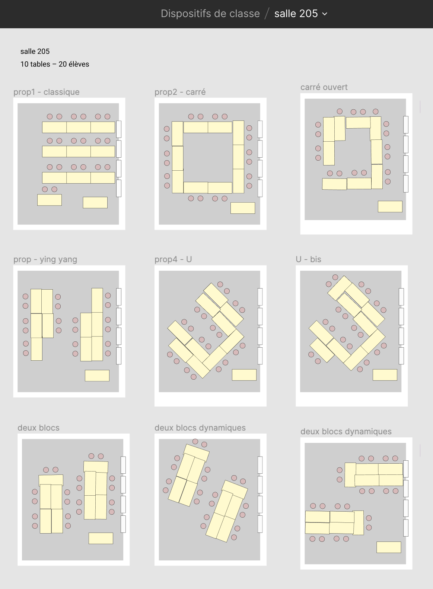

# pipapo

Références et infos pour le cours "Programmation 1".

Support de cours sur l'utilisation de Git: [https://cours-web.ch/git/](https://cours-web.ch/git/)

## Contenus des leçons

- Jour 01 (29 janvier) - [Présentations](J01-presentations)
- Jour 02 (5 février) - [Exploration de Github](J02-premiers-pas-Github)
- Jour 03 (12 février) - Les élèves créent leur premier repo Github
- Relâches
***
- Jour 04 (26 février) - Collaboration, création des redirections ([voir liste](https://github.com/eracom-id491/liste_site_citations#readme)).
- Jour 05 (4 mars) - Correctifs des redirections. Synchroniser (Github Desktop).
- Jour 06 (11 mars) - **Evaluation Git** 🧠📝
- Jour 07 (18 mars) - CSS #1
- Jour 08 (25 mars) - CSS #2
- Jour 09 (1er avril) - CSS #3
- Jour 10 (8 avril) - **Evaluation CSS** 🧠📝
- Vacances de Pâques 🐰
***
- Jour 11 (29 avril) - JavaScript #1
- Jour 12 (6 mai) - JavaScript #2
- **Semaine de workshops** (11-15 mai) - avec [Elisa Larvego](http://www.vego.ch/), photographe 📷
- Jour 13 (20 mai) - JavaScript #3
- Jour 14 (27 mai) - JavaScript #4
- Jour 15 (3 juin) - **Evaluation JavaScript** 🧠📝
- Jour 16 (10 juin) - Révisions
- Jour 17 (17 juin) - **Examen intermédiaire** 🧠🔥
- Semaine transversale (22-26 juin)

## Divers

- Idées d'alternatives de [disposition des tables](https://www.figma.com/file/M8v7VnTXthk55lmqbeJCsh/salle-205?node-id=0%3A1):

